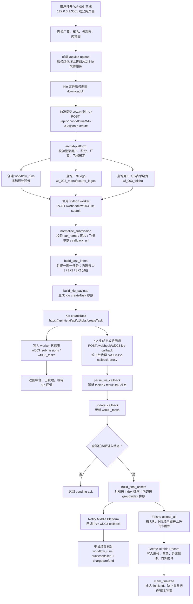

# WF-003 代码化数据流转说明

本文档说明 WF-003 从 n8n 迁移到 Python worker 后的数据流、关键文件职责，以及后续新增厂商或新增飞书表单时需要修改的位置。

## 1. 总体链路

WF-003 现在的目标是：前端仍按原流程上传图片和提交任务，但 n8n 的编排逻辑由 `wf003_worker` Python 服务接管。



## 2. 两个核心 Webhook

Python worker 暴露两个接口，等价替代 n8n 的两个 Webhook。

| 接口 | 文件 | 作用 |
| --- | --- | --- |
| `POST /webhook/wf003-kie-submit` | `WF-003/wf003_worker/app.py` | 接收中台提交，拆分任务，创建 Kie task，写入状态表 |
| `POST /webhook/wf003-kie-callback` | `WF-003/wf003_worker/app.py` | 接收 Kie 回调，更新任务状态，全部完成后 finalize |

本地容器端口是 `3013`，中台容器通过 `http://wf003-worker:3013/webhook/wf003-kie-submit` 调用它。

## 3. Python 文件职责

| 文件 | 主要职责 | 什么时候改 |
| --- | --- | --- |
| `WF-003/wf003_worker/app.py` | FastAPI 入口；定义 `/health`、提交 Webhook、Kie 回调 Webhook；负责把请求串到 repository、Kie、飞书、中台回调。 | 要新增接口、调整 finalize 顺序、改变“中台结算和飞书写表”的编排顺序时改这里。 |
| `WF-003/wf003_worker/config.py` | 读取环境变量；数据库、Kie、回调地址、飞书凭证、飞书字段名、重试次数都在这里统一配置。 | 要改默认模型、Kie URL、飞书字段名默认值、超时和重试策略时改这里；更推荐通过 `.env.docker` 配置。 |
| `WF-003/wf003_worker/models.py` | 定义 DTO/dataclass；保存 n8n 迁移后的标准数据结构；也放了外观和内饰 prompt。 | 要改 Kie prompt、任务数据结构、回调解析结果结构时改这里。 |
| `WF-003/wf003_worker/workflow.py` | 纯业务逻辑：提交参数归一化、内饰分组、任务拆分、Kie payload、Kie 回调解析、中台结算 payload、飞书上传 item、附件聚合。 | 要改流程规则时优先看这里，例如内饰 5 张如何分组、成功/失败如何判定、最终结果 URL 顺序、飞书附件分类名称。 |
| `WF-003/wf003_worker/repositories.py` | MySQL 状态存储；写 `wf003_submissions` 和 `wf003_tasks`；处理 callback 幂等和 finalize 锁。 | 要改状态表字段、完成判定 SQL、幂等/并发控制、最终结果聚合方式时改这里。 |
| `WF-003/wf003_worker/kie_client.py` | 调用 Kie `createTask`，读取 `KIE_API_KEY`，返回 Kie `taskId`。 | Kie API 升级、认证方式变化、返回字段变化时改这里。 |
| `WF-003/wf003_worker/middle_platform_client.py` | finalize 时回调中台；请求头带 `x-workflow-callback-token`。 | 中台 callback 协议、token header、错误处理策略变化时改这里。 |
| `WF-003/wf003_worker/feishu_client.py` | 飞书 tenant access token 缓存；按 URL 下载图片；调用 `drive/v1/medias/upload_all`；创建多维表记录。 | 飞书凭证、上传 API、表字段格式、附件格式、token 逻辑变化时改这里。 |
| `WF-003/wf003_worker/__init__.py` | Python 包标识文件，目前没有业务逻辑。 | 通常不用改。 |
| `WF-003/wf003_worker/tests/test_workflow.py` | 单元测试：覆盖提交校验、内饰分组、Kie payload、回调解析、附件聚合等核心规则。 | 每次改 `workflow.py` 或模型字段后，都应该补/跑这里的测试。 |

## 4. 关键数据库表

| 表 | 谁使用 | 作用 |
| --- | --- | --- |
| `workflow_runs` | 中台 | 用户工作流运行记录、冻结积分、最终结算状态、结果 URL。 |
| `wf003_submissions` | Python worker | 一次 WF-003 提交的总状态；保存 callback_url、callback_token、车名、飞书表单、预计任务数、finalized 锁。 |
| `wf003_tasks` | Python worker | 每个 Kie task 的状态；保存 taskId、任务类型、原图 URL、结果 URL、失败原因和回调原文。 |
| `wf_003_manufacturer_logos` | 中台 | 厂商列表和 logo；前端厂商下拉框、中台提交时解析 logo 都依赖这张表。 |
| `wf_003_feishu` | 中台 | 用户绑定的飞书多维表位置；保存 `feishu_app_id` 和 `feishu_id`。这里的 `feishu_app_id` 实际是飞书多维表 app token。 |
| `point_accounts` / `points_transactions` | 中台 | 积分账户和流水。 |

建表 SQL 在 `deploy/mysql-init.sql`。

## 5. 新增厂商要改哪里

### 推荐改法：只改数据库，不改 Python

新增厂商主要是给前端下拉框和中台 logo 查询使用，Python worker 不直接维护厂商列表。

需要写入表：

```sql
INSERT INTO wf_003_manufacturer_logos (
  manufacturer_code,
  manufacturer_name,
  logo_file_name,
  logo_mime_type,
  logo_public_url,
  logo_content,
  logo_sha256,
  is_active
) VALUES (
  'new_brand_code',
  '新厂商名称',
  'logo.png',
  'image/png',
  NULL,
  LOAD_FILE('/path/to/logo.png'),
  NULL,
  1
);
```

实际生产环境不建议直接依赖 `LOAD_FILE`，更稳的是写一个后台上传接口，或者用脚本把 logo 文件读成二进制写入 `logo_content`。

相关代码位置：

| 文件 | 说明 |
| --- | --- |
| `ai-mid-platform/src/workflows/wf003-manufacturer-logos.controller.ts` | 暴露 `GET /api/v1/wf003/manufacturers` 和 `GET /api/v1/wf003/manufacturers/:manufacturerCode/logo`。 |
| `ai-mid-platform/src/workflows/wf003-manufacturer-logos.service.ts` | 查询启用厂商、按 code 获取 logo、生成公开 logo URL。 |
| `ai-mid-platform/src/workflows/workflow-execution.service.ts` | `executeJsonWorkflow()` 中调用 `resolveWf003LogoUrl(manufacturerCode)`。 |
| `deploy/mysql-init.sql` | `wf_003_manufacturer_logos` 建表结构。 |

### 前端会自动读厂商列表

WF-003 前端会请求：

```http
GET /api/v1/wf003/manufacturers
```

只要新厂商在 `wf_003_manufacturer_logos` 中 `is_active=1`，并且中台服务能正常访问数据库，前端下拉框就会出现。

### 厂商 code 注意事项

- `manufacturer_code` 会被中台转成小写：`payload.manufacturer_code?.trim().toLowerCase()`。
- 前端提交的 `manufacturer_code` 必须能在 `wf_003_manufacturer_logos` 找到启用记录。
- 如果 `logo_public_url` 是 `tempfile.redpandaai.co` 这种临时 URL，中台会忽略它，改用自己的 `/api/v1/wf003/manufacturers/:code/logo` 输出稳定 logo。

## 6. 新增或更换飞书表单要改哪里

这里分两层：飞书应用凭证和用户绑定的多维表。

### 6.1 飞书应用凭证

worker 调飞书 OpenAPI 需要应用凭证，配置在 `.env.docker`：

```env
FEISHU_APP_ID=cli_xxx
FEISHU_APP_SECRET=xxx
```

相关代码：

| 文件 | 说明 |
| --- | --- |
| `WF-003/wf003_worker/config.py` | 读取 `FEISHU_APP_ID`、`FEISHU_APP_SECRET`、`FEISHU_BASE_URL`。 |
| `WF-003/wf003_worker/feishu_client.py` | 用应用凭证获取 tenant access token，并缓存到过期前。 |

如果只是换飞书应用，不需要改代码，改 `.env.docker` 后重启 worker：

```powershell
docker compose up -d --force-recreate wf003-worker
```

### 6.2 用户绑定哪个飞书多维表

每个用户绑定自己的多维表位置，保存在 `wf_003_feishu`：

```sql
INSERT INTO wf_003_feishu (user_id, feishu_app_id, feishu_id)
VALUES (用户ID, '多维表 app_token', 'table_id')
ON DUPLICATE KEY UPDATE
  feishu_app_id = VALUES(feishu_app_id),
  feishu_id = VALUES(feishu_id);
```

字段含义：

| 字段 | 实际含义 |
| --- | --- |
| `feishu_app_id` | 飞书多维表 app token，例如 `Tim...`。注意这不是 `cli_` 开头的飞书应用 ID。 |
| `feishu_id` | 飞书多维表 table id，例如 `tbl...`。 |

相关代码：

| 文件 | 说明 |
| --- | --- |
| `ai-mid-platform/src/workflows/workflow-execution.service.ts` | `getWf003UserMetadata()` 从 `wf_003_feishu` 读取当前用户的表单绑定，并随提交传给 worker。 |
| `WF-003/wf003_worker/workflow.py` | `normalize_submission()` 要求 `feishu_app_id`、`feishu_id` 必填；`build_feishu_upload_items()` 把它们带到上传项。 |
| `WF-003/wf003_worker/feishu_client.py` | `create_bitable_record()` 用 `feishu_app_id` 和 `feishu_id` 创建记录。 |

### 6.3 飞书表字段名

当前代码创建多维表记录时写入 4 个字段：

| 业务字段 | 默认环境变量 | 默认字段名 |
| --- | --- | --- |
| 编号 | `WF003_FEISHU_FIELD_NUMBER` | `编号` |
| 车名 | `WF003_FEISHU_FIELD_CAR_NAME` | `车名` |
| 外观附件 | `WF003_FEISHU_FIELD_EXTERIOR` | `外观附件` |
| 内饰附件 | `WF003_FEISHU_FIELD_INTERIOR` | `内饰附件` |

如果新飞书表字段名不同，优先改 `.env.docker`：

```env
WF003_FEISHU_FIELD_NUMBER=编号
WF003_FEISHU_FIELD_CAR_NAME=车名
WF003_FEISHU_FIELD_EXTERIOR=外观附件
WF003_FEISHU_FIELD_INTERIOR=内饰附件
```

然后重启 worker：

```powershell
docker compose up -d --force-recreate wf003-worker
```

如果字段结构变了，比如想新增“厂商”“提交人”“生成时间”，需要改：

- `WF-003/wf003_worker/feishu_client.py` 的 `create_bitable_record()`，往 `payload["fields"]` 增加字段。
- 如字段值来自提交参数，还要改 `models.py`、`workflow.py`、`repositories.py`，把字段从中台传入、落库、finalize 时带出来。

## 7. Kie 相关配置在哪里改

| 需求 | 推荐修改 |
| --- | --- |
| 换 Kie API key | `.env.docker` 的 `KIE_API_KEY` |
| 换 Kie createTask URL | `.env.docker` 的 `KIE_CREATE_TASK_URL` |
| 换模型 | `.env.docker` 的 `KIE_IMAGE_MODEL`，默认 `nano-banana-2` |
| 换 Kie 回调公网地址 | `.env.docker` 的 `WF003_KIE_CALLBACK_URL`，或配置 `MIDDLE_PLATFORM_PUBLIC_BASE_URL` |
| 改外观/内饰 prompt | `WF-003/wf003_worker/models.py` 的 `EXTERIOR_PROMPT` / `INTERIOR_PROMPT` |
| 改 Kie payload 字段 | `WF-003/wf003_worker/workflow.py` 的 `build_kie_payload()` |

当前 Kie callback URL 生成规则在 `WF-003/wf003_worker/config.py`：

1. 如果设置了 `WF003_KIE_CALLBACK_URL`，优先使用它。
2. 否则如果设置了 `MIDDLE_PLATFORM_PUBLIC_BASE_URL`，使用 `{base}/api/v1/workflow-runs/wf003-kie-callback-proxy`。
3. 否则使用 `{WF003_PUBLIC_BASE_URL}/webhook/wf003-kie-callback`。

## 8. 前端上传图片为什么有代理

之前浏览器直接请求 Kie 上传接口，容易遇到：

- CORS / `Failed to fetch`。
- `socket hang up`。
- 中文文件名被上游 multipart 处理异常。
- Kie API key 暴露在浏览器。

现在前端默认上传到同源：

```http
POST /api/kie-upload
```

相关文件：

| 文件 | 说明 |
| --- | --- |
| `WF-003/car-export-portal/script.js` | `KIE_UPLOAD_URL` 默认 `/api/kie-upload`。 |
| `WF-003/car-export-portal/server.js` | 接收浏览器上传，改成安全 ASCII 文件名，再服务端带 `KIE_API_KEY` 转发给 Kie。 |

## 9. 修改后怎么验证

### 9.1 Python worker 单元测试

```powershell
$env:PYTHONPATH='D:\ai-workflow\WF-003'
python -m pytest .\WF-003\wf003_worker\tests -q
```

### 9.2 容器健康检查

```powershell
docker compose ps
curl.exe -s http://127.0.0.1:3002/health/db
curl.exe -s http://127.0.0.1:3013/health
curl.exe -s http://127.0.0.1:3001/runtime-config.js
```

### 9.3 数据库检查

```sql
SELECT run_id, status, billing_status, actual_completed_count, final_charge_points, refund_points
FROM workflow_runs
WHERE workflow_code = 'WF-003'
ORDER BY created_at DESC
LIMIT 5;

SELECT submission_id, expected_tasks, finalized, finalize_in_progress, finalize_error
FROM wf003_submissions
ORDER BY created_at DESC
LIMIT 5;

SELECT task_id, submission_id, type, task_index, group_index, state, result_url
FROM wf003_tasks
ORDER BY created_at DESC
LIMIT 10;
```

## 10. 常见问题定位

| 现象 | 优先检查 |
| --- | --- |
| 登录提示 `request failed` | `docker compose ps` 看 `db` 是否启动；再看 `curl http://127.0.0.1:3002/health/db`。 |
| 前端厂商下拉框为空 | `wf_003_manufacturer_logos` 是否有 `is_active=1`；中台 `/api/v1/wf003/manufacturers` 是否 200。 |
| 提交时报 `feishu_app_id is required` | 当前用户在 `wf_003_feishu` 没有绑定多维表。 |
| Kie 不回调 | 检查 `WF003_KIE_CALLBACK_URL` 或 `MIDDLE_PLATFORM_PUBLIC_BASE_URL` 是否是 Kie 能访问的公网地址。 |
| 中台已结算但飞书没附件 | 看 worker callback 返回的 `uploadFailures`；重点检查飞书字段名、app token、table id、飞书应用权限。 |
| 重复 Kie callback | 正常应幂等；`wf003_submissions.finalized` 和 `finalize_in_progress` 会防止重复 finalize。 |

## 11. 最小改动建议

- 新增厂商：优先只新增 `wf_003_manufacturer_logos` 数据，不动 Python。
- 新增用户飞书表单：优先只新增或更新 `wf_003_feishu` 数据，不动 Python。
- 换飞书表字段名：优先用 `.env.docker` 的 `WF003_FEISHU_FIELD_*` 配置，不动 Python。
- 改生成逻辑或任务拆分：改 `WF-003/wf003_worker/workflow.py`，然后补 `tests/test_workflow.py`。
- 改外部 API 细节：Kie 改 `kie_client.py`，飞书改 `feishu_client.py`，中台回调改 `middle_platform_client.py`。
